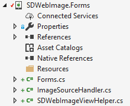
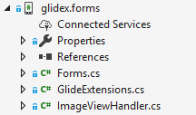
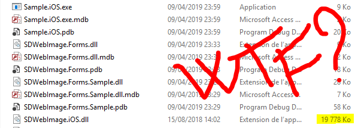

# Warning: obsolete repository

This repository has been deprecated in favor of https://github.com/roubachof/Xamarin.Forms.Nuke

# FFImageLoading.ImageSourceHandler


This repository was inspired by Jonathan Peppers ```GlideX``` implementation of the new ```IImageViewHandler``` interface for ```Xamarin.Forms``` (https://github.com/jonathanpeppers/glidex).

Its goal is to provide the same kind of implementation for ```iOS```, achieving a complete image caching solution for ```Xamarin.Forms```: you don't have to change any line of your existing project, the ```Xamarin.Forms``` image source handlers will just be overridden with cache-enabled ones.

On ```iOS``` the ```ImageSourceHandler``` is implemented with ```FFImageLoading``` (https://github.com/luberda-molinet/FFImageLoading).

## Benchmark

I changed a bit the ```glidex``` benchmark samples to have a more fair comparison. I switched from a random distribution of the images to a deterministic one to be sure we are comparing the same data set.

I used ```System.Diagnostics.Process.GetCurrentProcess().WorkingSet64``` to have the memory workload of the process. The value given in the results are the **consumed bytes** between the ```MainPage``` and the complete loading of the target page.

For each test:

1. Launch simulator
2. Wait 4-5 seconds on ```MainPage```
3. Launch a Page
4. Scroll till the end of page
5. Get consumed bytes in the output window


<table>
	<thead>
		<tr>
      <th>Page</th>
      <th>Data Type</th>
			<th>Xamarin.Forms</th>
      <th>FFIL.ImageSourceHandler</th>
		</tr>
	</thead>
	<tbody>
		<tr>
			<td>GridOnlyRemotePage</td>
			<td>Remote only</td>
      <td align="right">247 828 480</td>
      <td align="right">18 698 240 <b><font color="greev">(-92%)</font></b></td>
		</tr>
		<tr>
			<td>GridPage</td>
			<td>Remote and local mix</td>
      <td align="right">186 748 928</td>
      <td align="right">18 644 992 <b><font color="greev">(-90%)</font></b></td>
		</tr>
		<tr>
			<td>ViewCellPage</td>
			<td>Remote and local mix</td>
      <td align="right">36 646 912</td>
      <td align="right">17 829 888 <b><font color="greev">(-51%)</font></b></td>
		</tr>
		<tr>
			<td>ImageCellPage</td>
			<td>Remote and local mix</td>
      <td align="right">81 604 608</td>
      <td align="right">12 218 368 <b><font color="greev">(-85%)</font></b></td>
		</tr>
		<tr>
			<td>HugeImagePage</td>
			<td>Local only</td>
      <td align="right">124 104 704</td>
      <td align="right">11 902 976 <b><font color="greev">(-90%)</font></b></td>
		</tr>
	</tbody>
</table>

## Installation

### FFImageLoading.ImageSourceHandler


1. Install https://www.nuget.org/packages/ffimageloading.imagesourcehandler/ in your xamarin forms **iOS** project
2. Add this Init method after ```Forms.Init``` call:

```csharp
Xamarin.Forms.Forms.Init();
FFImageLoading.FormsHandler.Init(debug: false);
LoadApplication(new SDWebImageForms.Sample.Views.App());
```

### GlideX.Forms

1. Install https://www.nuget.org/packages/glidex.forms/ in your xamarin forms **Android** project
2. Add this one liner after your app's ```Forms.Init``` call:

```csharp
Xamarin.Forms.Forms.Init (this, bundle);
//This forces the custom renderers to be used
Android.Glide.Forms.Init ();
LoadApplication (new App ());
```

### BOOM

Jou just achieved **90%+** memory reduction when manipulating ```Image``` views on **both** platforms.

## Implementation details

Read the complete post on Sharpnado: https://www.sharpnado.com/ultimate-image-caching

I had an issue with the naming. Following Jonathan's convention was leading me to ```FFImageLoading.Forms```, and well it's already taken.

So I leaned towards a more describing name:

```
FFImageLoading.ImageSourceHandler
```

Otherwise the project structure is the same that ```GlideX.Forms``` really. ```FFImageLoading``` supports the 3 ```Xamarin.Form```s image sources.

```csharp
[assembly: ExportImageSourceHandler(
    typeof(FileImageSource), typeof(FFImageLoading.ImageSourceHandler))]
[assembly: ExportImageSourceHandler(
    typeof(StreamImageSource), typeof(FFImageLoading.ImageSourceHandler))]
[assembly: ExportImageSourceHandler(
    typeof(UriImageSource), typeof(FFImageLoading.ImageSourceHandler))]

namespace FFImageLoadingX
{
    [Preserve (AllMembers = true)]
    public class ImageSourceHandler : IImageSourceHandler
    {
        public Task<UIImage> LoadImageAsync(
            ImageSource imageSource,
            CancellationToken cancellationToken = new CancellationToken(),
            float scale = 1)
        {
            return FFImageLoadingHelper.LoadViaFFImageLoading(
                imageSource, cancellationToken);
        }
    }
}
```

And then ```FFImageLoadingHelper``` is calling the following methods based on the type of the ```ImageSource```:

```csharp
private static Task<UIImage> LoadImageAsync(string urlString)
{
    return ImageService.Instance
        .LoadUrl(urlString)
        .AsUIImageAsync();
}

private static Task<UIImage> LoadFileAsync(string filePath)
{
    return ImageService.Instance
        .LoadFile(filePath)
        .AsUIImageAsync();
}

private static Task<UIImage> LoadStreamAsync(StreamImageSource streamSource)
{
    return ImageService.Instance
        .LoadStream(token => ((IStreamImageSource)streamSource).GetStreamAsync(token))
        .AsUIImageAsync();
}
```

### Advantages

1. It handles local files
2. UIImage are correctly created (it respects scale factor)
3. It's 100% C#
4. The library is really small

## FAQ

### 1. Why not just use ```FFImageLoading``` and its ```CachedImage``` ?

Well ```FFImageLoading``` is still in my opinion a really decent choice.

Nonetheless, ```glidex``` outperforms ```FFImageLoading``` on ```Android```.
I ran several tests.
And ```GlideX``` is loading faster that ```FFImageLoading``` everytime.

This is from a cold start:

<table>
	<thead>
		<tr>
      <th>GlideX</th>
      <th>FFImageLoading</th>
		</tr>
	</thead>
	<tbody>
		<tr>
      <td></td>
			<td></td>
		</tr>
  </tbody>
</table>

On first run ```FFImageLoading``` has a smaller memory footprint. But after some back and forth it uses more memory compared to ```Glide```. ```Glide``` clearly balances memory and loading speed, we can suspect some advanced memory management / speeding technics.

Also you can use regular ```Xamarin.Forms``` ```Image``` view instead of a custom view.

It really shines on existing projects: if you want to give a boost to your ```Xamarin.Forms``` app, you just have to install 2 nuget packages and BOOM -95% of memory used :)

### 2. Why not fork ```FFImageLoading``` and embed ```GlideX``` ?

It's not the philosophy of the lib. The lib is clearly a 100% C# lib, binding existing native library defeats the purpose.

### 3. Should I migrate from ```FFImageLoading``` to ```GlideX + FFIL.ImageSourceHandler```

It really depends.
If you have some issues with performance on Android you can give it a try. But if all is already working smoothly, I don't really see why you would do it.

## SDWebImage: a discarded implementation

## SDWebImage

I shamelessly took the Jonathan Peppers repo and just renamed everything with ```SDWebImage``` to have a real symetrical implementation.

<table>
	<tbody>
		<tr>
			<td></td>
			<td></td>
		</tr>
    <tr>
      <td colspan=2><i>Any resemblance to real projects, living or dead, is purely coincidental</i></td>
    </tr>
  </tbody>
</table>

### ImageSourceHandler vs IImageViewHandler

Thanks to Jonathan and since ```Xamarin.Forms 3.3.0```, we have now a ```IImageViewHandler``` interface on the Android platform. It allows to directly deal with ```ImageView``` to implement the ```ImageSource``` on the platform.

```csharp
[assembly: ExportImageSourceHandler(
	typeof (FileImageSource), typeof (Android.Glide.ImageViewHandler))]
[assembly: ExportImageSourceHandler(
	typeof (StreamImageSource), typeof (Android.Glide.ImageViewHandler))]
[assembly: ExportImageSourceHandler(
	typeof (UriImageSource), typeof (Android.Glide.ImageViewHandler))]

namespace Android.Glide
{
	[Preserve (AllMembers = true)]
	public class ImageViewHandler : IImageViewHandler
	{
		public ImageViewHandler ()
		{
			Forms.Debug (
				"IImageViewHandler of type `{0}`, instance created.",
				GetType ());
		}

		public async Task LoadImageAsync(
			ImageSource source,
			ImageView imageView,
			CancellationToken token = default(CancellationToken))
		{
			Forms.Debug(
				"IImageViewHandler of type `{0}`, `{1}` called.",
				GetType(),
				nameof(LoadImageAsync));

			await imageView.LoadViaGlide(source, token);
		}
	}
}
```

On the ```iOS``` side, we can deal directly with the ```IImageSourceHandler``` returning an ```UIImage```.

```csharp
[assembly: ExportImageSourceHandler(
    typeof(UriImageSource), typeof(SDWebImage.Forms.ImageSourceHandler))]

namespace SDWebImage.Forms
{
    [Preserve (AllMembers = true)]
    public class ImageSourceHandler : IImageSourceHandler
    {
        public Task<UIImage> LoadImageAsync(
            ImageSource imageSource,
            CancellationToken cancellationToken = new CancellationToken(),
            float scale = 1)
        {
            return SDWebImageViewHelper.LoadViaSDWebImage(
                imageSource, cancellationToken);
        }
    }
}
```

```SDWebImage``` has a simple api to download and cache ```UIImage```.

```csharp
private static Task<UIImage> LoadImageAsync(string urlString)
{
    var tcs = new TaskCompletionSource<UIImage>();

    SDWebImageManager.SharedManager.LoadImage(
        new NSUrl(urlString),
        SDWebImageOptions.ScaleDownLargeImages,
        null,
        (image, data, error, cacheType, finished, url) =>
            {
                if (image == null)
                {
                    Forms.Debug("Fail to load image: {0}", url.AbsoluteUrl);
                }

                tcs.SetResult(image);
            });

    return tcs.Task;
}
```

However it doesn't support local files, only remote ones. That means that local resources are still processed by ```Xamarin.Forms```.

```csharp
public sealed class FileImageSourceHandler : IImageSourceHandler
{
	public Task<UIImage> LoadImageAsync(
		ImageSource imagesource,
		CancellationToken cancelationToken = default(CancellationToken),
		float scale = 1f)
	{
		UIImage image = null;
		var filesource = imagesource as FileImageSource;
		var file = filesource?.File;
		if (!string.IsNullOrEmpty(file))
			image = File.Exists(file)
		        ? new UIImage(file)
		        : UIImage.FromBundle(file);

		if (image == null)
		{
			Log.Warning(
				nameof(FileImageSourceHandler),
				"Could not find image: {0}",
				imagesource);
		}

		return Task.FromResult(image);
	}
}
```

**Remark:** I don't really know if it would be interesting to have also a ```IUIImageViewHandler``` interface on ```iOS```. I don't know if it would improve the performance vs a ```UIImage``` cache.

### Benchmarking!

Since all test pages use a mix of local resources and remote ones, and ```SDImageWeb``` only process remote files, I created a special page named ```GridOnlyRemotePage```.

<table>
	<thead>
		<tr>
      <th>Page</th>
      <th>Data Type</th>
			<th>Xamarin.Forms</th>
			<th>SDWebImage</th>
		</tr>
	</thead>
	<tbody>
		<tr>
			<td>GridOnlyRemotePage</td>
			<td>Remote only</td>
      <td>247828480</td>
			<td>14229504 <b><font color="greev">(-94%)</font></b></td>
		</tr>
		<tr>
			<td>GridPage</td>
			<td>Remote and local mix</td>
      <td>186748928</td>
			<td>92033024 <b><font color="greev">(-50%)</font></b></td>
		</tr>
		<tr>
			<td>ViewCellPage</td>
			<td>Remote and local mix</td>
      <td>36646912</td>
			<td>18288640 <b><font color="greev">(-50%)</font></b></td>
		</tr>
		<tr>
			<td>ImageCellPage</td>
			<td>Remote and local mix</td>
      <td>81604608</td>
			<td>25874432 <b><font color="greev">(-68%)</font></b></td>
		</tr>
		<tr>
			<td>HugeImagePage</td>
			<td>Local only</td>
      <td>124104704</td>
			<td>Same as XF <b><font color="red">(0%) </td>
		</tr>
	</tbody>
</table>

### Downsides

Of course the impact is huge for remote files (memory footprint of ```SDWebImage``` is **5%** of ```Xamarin.Forms```!) but at this point I was pretty disappointed:

1. ```SDWebImage``` doesn't handle local resources
2. It doesn't take into account the scale (x2 per instance for retina) of the screen. So the ```UIImage``` instead of being scale 2 and size ```{Width=150, Height=150}``` was scale 1 and size ```{Width=300, Height=300}```
3. The lib is HUGE (well of course it would have been linked, but still):

